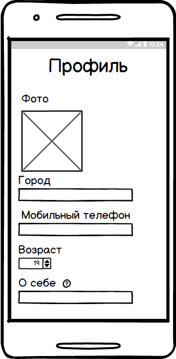
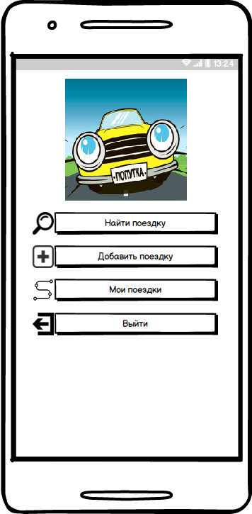

# Требования к проекту
---

# Содержание
1 [Введение](#intro)  
1.1 [Назначение](#appointment)  
1.2 [Бизнес-требования](#business_requirements)  
1.2.1 [Исходные данные](#initial_data)  
1.2.2 [Возможности бизнеса](#business_opportunities)  
1.2.3 [Границы проекта](#project_boundary)  
1.3 [Аналоги](#analogues)  
2 [Требования пользователя](#user_requirements)  
2.1 [Программные интерфейсы](#software_interfaces)  
2.2 [Интерфейс пользователя](#user_interface)  
2.3 [Характеристики пользователей](#user_specifications)  
2.3.1 [Классы пользователей](#user_classes)  
2.3.2 [Аудитория приложения](#application_audience)  
2.3.2.1 [Целевая аудитория](#target_audience)   
2.4 [Предположения и зависимости](#assumptions_and_dependencies)  
3 [Системные требования](#system_requirements)  
3.1 [Функциональные требования](#functional_requirements)  
3.1.1 [Основные функции](#main_functions)  
3.1.1.1 [Вход пользователя в свой акаунт](#login_to_acaunt)  
3.1.1.2 [Регистрация нового пользователя](#add_new_user)   
3.1.1.3 [Добавление нового маршрута](#add_new_trip)  
3.1.1.4 [Просмотр поездок](#veiw_a_trips)  
3.1.1.5 [Поиск маршрута](#find_a_trip)  
3.1.1.6 [Общение с водителем](#communication_with_driver)   
3.1.1.7 [Выход из акаунта](#logout_from_acaunt)   
3.1.2 [Ограничения и исключения](#restrictions_and_exclusions)    
3.2 [Нефункциональные требования](#non-functional_requirements)  
3.2.1 [Атрибуты качества](#quality_attributes)  
3.2.1.1 [Требования к удобству использования](#requirements_for_ease_of_use)  
3.2.1.2 [Требования к безопасности](#security_requirements)  
3.2.2 [Внешние интерфейсы](#external_interfaces)   

<a name="intro"/>

# 1 Введение

<a name="appointment"/>

## 1.1 Назначение
В этом документе описаны функциональные и нефункциональные требования к мобильному приложению для поиска попутчиков «Попутка». Этот документ предназначен для команды, которая будет реализовывать и проверять корректность работы приложения.

<a name="business_requirements"/>

## 1.2 Бизнес-требования

<a name="initial_data"/>

### 1.2.1 Исходные данные
Современный мир не стоит на месте. Существует постоянная необходимость в перемещении, и не только по городу, но возможно и за границу. Для этого используются различные средства передвижения, начиная от собственных авто и заканчивая полётами на самолётах. Но это не всегда может быть удобно по ряду причин: отсутствие собственного автомобиля, не совпадение Вашего расписания с расписанием движения транспорта и банальная боязнь летать.

<a name="business_opportunities"/>

### 1.2.2 Возможности бизнеса
Некоторым людям удобнее всего передвигать с помощью автомобиля, но у одних его нет, а для других поездка может оказаться слишком затратной или скучной. Поэтому возникает необходимость в поиске попутчика, с которым можно будет разделить и расходы на поездку и провести время в компании. Подобное приложение поможет решить данную проблему.

<a name="project_boundary"/>

### 1.2.3 Границы проекта
Приложение «Попутка» позволит пассажирам найти для себя удобный вариант поездки, согласно их предпочтениям. Водителям оно позволит оставлять заявки на поиск попутчиков для поездки.

<a name="analogues"/>

## 1.3 Аналоги
|Функции|Попутчик-Online|Попутчик|Поедем вместе|  
|:---|:---|:---|:---|  
|Доступно на Android|+|+|+|  
|Просмотр карты|+|+|-|  
|Поиск попутчиков на мероприятие|-|+|-|  
|Сообщения между водителем и пассажиром|+|+|-|

<a name="user_requirements"/>

# 2 Требования пользователя

<a name="software_interfaces"/>

## 2.1 Программные интерфейсы
Приложение обрабатывает запросы пользователя и хранит всю информацию в облачной базе данных Firebase. Приложение реализовано для операционной системы Android, с помощью языка Java.

<a name="user_interface"/>

## 2.2 Интерфейс пользователя
Окно входа в приложение.  
   
Окно регистрации нового пользователя.  
   
Окно заполнения профиля нового пользователя.   
   
Окно авторизации.   
    
Главное окно приложения.   
    
Окно для добавления поездки.   
     
Окно поиска поездки.   
   
Окно результатов поиска.   
   
Окно с информацией о поездке.   
   
Окно с информацией о всех поездках пользователя.   
   
<a name="user_specifications"/>

## 2.3 Характеристики пользователей

<a name="user_classes"/>

### 2.3.1 Классы пользователей

| Класс пользователей | Описание |
|:---|:---|
| Зарегистрированные пользователи | Пользователи, прошедшие авторизацию. Имеют полный доступ ко всем функциям приложения|

<a name="application_audience"/>

### 2.3.2 Аудитория приложения

<a name="target_audience"/>

#### 2.3.2.1 Целевая аудитория
Люди любой возрастной категории,для которых важен комфорт и цена поездки.

<a name="assumptions_and_dependencies"/>

## 2.4 Предположения и зависимости
Приложение не работает при отсутствии подключения к Интернету;

<a name="system_requirements"/>

# 3 Системные требования

<a name="functional_requirements"/>

## 3.1 Функциональные требования

Работа приложения осуществляется на платформе Android.

<a name="main_functions"/>

### 3.1.1 Основные функции

<a name="login_to_acaunt"/>

#### 3.1.1.1 Вход пользователя в свой аккаунт
Пользователь имеет возможность войти в свой профиль.
<a name="add_new_user"/>

#### 3.1.1.2 Регистрация нового пользователя
Анонимный пользователь имеет возможность зарегистрироваться в приложении. 

<a name="add_new_trip"/>

#### 3.1.1.3 Добавление нового маршрута
Авторизированный пользователь может добавить новый маршрут. Водитель имеет право установить цену поездки. Пассажир может расплатиться с водителем наличными по окончании поездки.

<a name="veiw_a_trips"/>

#### 3.1.1.4 Просмотр поездок
Пользователь имеет возможность просмотреть все свои поездки.
<a name="find_a_trip"/>

#### 3.1.1.5 Поиск маршрута

Пользователь может по заданным критериям найти попутчика.

<a name="communication_with_driver"/>

#### 3.1.1.6 Общение с водителем

Пользователь имеет возможность переписываться с водителем, для уточнения организационных вопросов.
<a name="logout_from_acaunt"/>

#### 3.1.1.7 Выход из акаунта
Пользователь имеет возможность выйти из акаунта.

<a name="restrictions_and_exclusions"/>

### 3.1.2 Ограничения и исключения
1. Приложение работает только при наличии подключения к Интернету;
2. Работа приложения осуществляется на платформе Android минимальной версии 4.0.3.

<a name="non-functional_requirements"/>

## 3.2 Нефункциональные требования

<a name="quality_attributes"/>

### 3.2.1 Атрибуты качества

<a name="requirements_for_ease_of_use"/>

#### 3.2.1.1 Требования к удобству использования
1. Использование выдержанной для всего приложения цветовой гаммы;
2. Однозначные названия и/или общепринятые обозначения функциональных элементов пользовательского интерфейса.

<a name="security_requirements"/>

#### 3.2.1.2 Требования к безопасности
Авторизация происходит по паролю, заданному пользователем, соответствующему определенному стандарту надёжности.

<a name="external_interfaces"/>

### 3.2.2 Внешние интерфейсы
Окна приложения удобны для использования пользователями с плохим зрением:
  * размер шрифта не менее 13пт;
  * функциональные элементы контрастны фону окна.Название и символы элементов интерфейса напрямую описывают их функционал.
